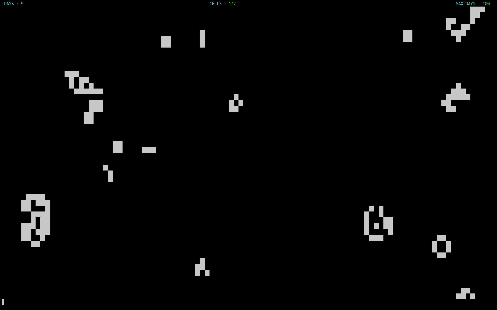
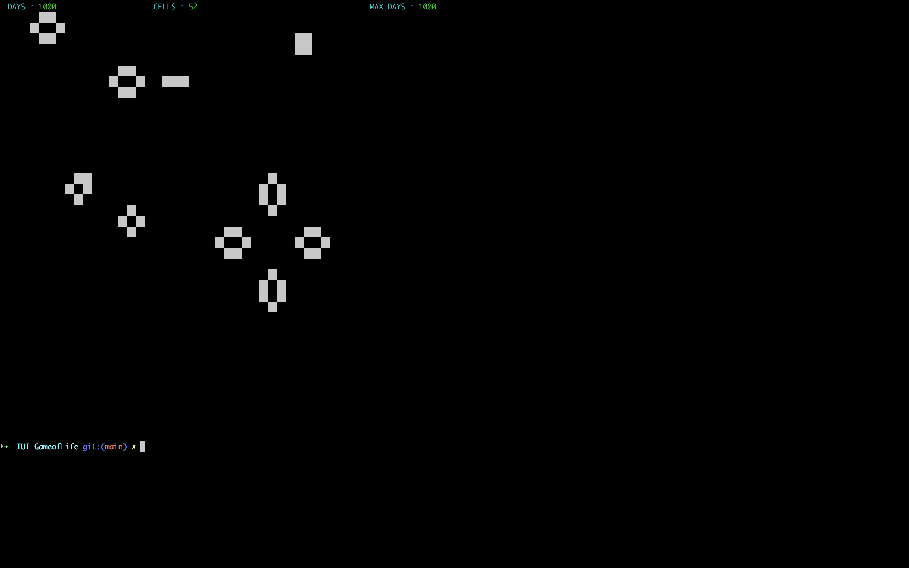
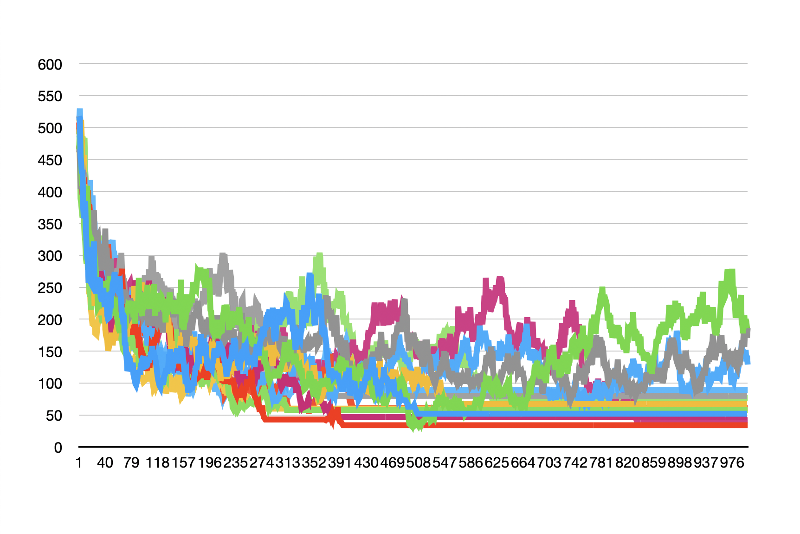

# TUI-GameofLife

Ce mini-projet permet de lancer un jeu de la vie avec comme interface graphique le terminal. Une explication du principe de ce jeu est disponible sur [Wikipedia](https://fr.wikipedia.org/wiki/Jeu_de_la_vie).



Pour exécuter le programme il faut suivre les commandes suivante:

```bash
$ git clone https://github.com/yanistvg/TUI-GameofLife.git
$ cd TUI-GameOfLife
$ make
gcc -Wall -Wextra -Wconversion -c main.c
gcc -Wall -Wextra -Wconversion -c libs/srcs/interact-terminal.c
gcc -Wall -Wextra -Wconversion -c libs/srcs/game.c
gcc -Wall -Wextra -Wconversion -c libs/srcs/parse.c
gcc -Wall -Wextra -Wconversion -c libs/srcs/show_game.c
gcc -Wall -Wextra -Wconversion -c libs/srcs/draw_utils.c
gcc -Wall -Wextra -Wconversion -c libs/srcs/interact-file.c
gcc -Wall -Wextra -Wconversion -o TUI-GameOfLife main.o interact-terminal.o game.o parse.o show_game.o draw_utils.o interact-file.o
$ ./TUI-GameOfLife
```

Par défaut, le programme va utiliser la taille de la fenètre comme bordure du jeu, et dans l'application des règles du jeu de la vie, les bordure sont connectés comme la représentation d'une sphère en 2D.

Un certain nombre de paramètre sont disponibles pour exécuter le programme:

```bash
$ ./TUI-GameOfLife --help

Manuel pour l'execution du programme :
	Si le programme est lancer sans parametres, ce dernier va choisir un nombre de cellules aleatoirement est lancer l'execution.

	--help                     - pour afficher ce manuel
	--cells-numbers <number>   - permet de selectionner le nombre de cellules pour la simulation, le nombre dois etre superieur a zero
	--days <number>            - permet de choisir le nombre de generation a effectuer: par default 100
	--delay <number>           - permet de selectionner le delay entre chaque jours. nombre en microseconde. Par defaut, 1s
	--size-x <number>          - permet de definir la taille en x de la grille de jeu. La valeur doit etre superieur a 30 et inferieur a la taille de la fenetre
	--size-y <number>          - permet de definir la taille en y de la grille de jeu. La valeur doit etre superieur a 10 et inferieur a la taille de la fenetre

	--export-csv <file>        - permet d'exporter le nombre de cellules par interation au format CSV
```

Le fait de pouvoir exporter les données lors de l'exécution permet de faire une visualisation dans le temps du nombre de cellules. Nous pouvons par exemple utiliser la commande suivante a plusieur reprise

```bash
./TUI-GameOfLife --cells-numbers 500 --days 1000 --delay 0 --size-x 100 --size-y 40 --export-csv ~/Desktop/game-of-life.csv
```

ce qui donne des exécutions instantané, et une sauvegarde du nombre de cellules par itération dans un fichier csv.



Nous obtenons suite à plusieur exécution le fichier CSV qui contient l'historique de ces exécution dont nous pouvons afficher les courbes du nombre de cellules par jours pour obtenir les courbes suivantes :


